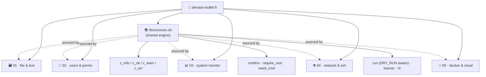

<div align="center">

# 🧰 devops-toolkit-5

### `5 folders` · `24 single-purpose scripts` · `1 shared engine`

**Turning a raw Linux command cheat-sheet into a working, guarded DevOps toolkit.**
*הופך רשימת פקודות לינוקס גולמית לערכת כלים אמיתית, מסודרת ומוגנת.*

<br/>

[](https://github.com/www8351/5-DevOps-Toolkit/actions/workflows/shellcheck.yml)
[](https://github.com/www8351/5-DevOps-Toolkit/actions/workflows/python.yml)
<br/>


<br/>


</div>

---

## 🌍 What is this? · מה זה?

<table>
<tr>
<td width="50%" valign="top">

### 🇬🇧 English

This repository is a **portfolio of small, sharp shell scripts** built from a hand-written list of Linux,
networking, Docker and AWS commands.

Instead of one giant script, the commands are composed into **24 focused tools** spread across **5 themed
folders**. Every tool does *one* thing well, sources a **shared engine** (`lib/common.sh`), and ships with
help text, dependency checks and safety guards.

The point isn't the commands themselves — it's the **assembly**: how primitives like `find`, `awk`, `du`,
`docker` and `nmap` are wired into reliable, reusable tools.

</td>
<td width="50%" valign="top">

<div dir="rtl">

### 🇮🇱 עברית

המאגר הזה הוא **תיק עבודות של סקריפטים קטנים וחדים** שנבנו מתוך רשימת פקודות לינוקס, רשת, Docker ו-AWS
שנכתבה ביד.

במקום סקריפט ענק אחד, הפקודות מורכבות ל-**24 כלים ממוקדים** הפרוסים על פני **5 תיקיות נושאיות**. כל כלי
עושה *דבר אחד* טוב, טוען **מנוע משותף** (`lib/common.sh`), ומגיע עם מסך עזרה, בדיקות תלויות ומנגנוני
הגנה.

העיקר הוא לא הפקודות עצמן — אלא **ההרכבה**: איך אבני בניין כמו `find`, `awk`, `du`, `docker` ו-`nmap`
מחוברות לכלים אמינים שאפשר לעשות בהם שימוש חוזר.

</div>

</td>
</tr>
</table>

---

## 🗂️ The 5 Modules

| # | Folder | Focus | Scripts | Key commands |
|:-:|--------|-------|:-------:|--------------|
| 🗃️ **01** | [`01-file-text-toolkit`](01-file-text-toolkit/) | files & text plumbing | 5 | `du` `grep` `awk` `find` `tar` |
| 👤 **02** | [`02-user-permissions`](02-user-permissions/) | users, groups & permissions | 5 | `useradd` `chmod` `chown` `usermod` |
| 📊 **03** | [`03-system-monitor`](03-system-monitor/) | system & hardware | 5 | `lscpu` `df` `free` `ps` `swapon` |
| 🌐 **04** | [`04-network-ssh`](04-network-ssh/) | networking & SSH | 5 | `ip` `ss` `nmap` `curl` `ssh-keygen` |
| 🐳 **05** | [`05-docker-devops`](05-docker-devops/) | Docker, packages & cloud | 5 | `docker` `apt` `boto3` |

---

## 🧬 Architecture



Every script `source`s **`lib/common.sh`** — a single shared engine that provides coloured logging,
`confirm` prompts, `require_root` / `need_cmd` guards and a `run` wrapper that honours `DRY_RUN=1`. One
library, 24 consumers — **DRY by design**, not copy-paste.

---

## 🚀 Quick start

```bash
# 1. clone
git clone https://github.com/www8351/devops-toolkit-5.git
cd devops-toolkit-5

# 2. make the scripts executable (Linux / WSL / macOS)
chmod +x lib/common.sh **/*.sh

# 3. every script self-documents
./01-file-text-toolkit/dirsnap.sh --help

# 4. run something harmless
./01-file-text-toolkit/dirsnap.sh -n 5 .
./03-system-monitor/sysinfo.sh
./04-network-ssh/httpcheck.sh https://github.com https://example.com

# 5. preview a destructive tool WITHOUT touching the system
DRY_RUN=1 ./03-system-monitor/mkswap.sh -s 1G -f /swapfile
```

> 🪟 **Windows users:** the commands target **Linux**. Run the read-only scripts in **Git Bash**, and the
> system/root scripts inside **WSL** or a Linux VM.

---

## 🛡️ Safety model

Every script follows the same defensive contract:

- `set -euo pipefail` — fail fast, fail loud.
- **`-h` / `--help`** on every tool.
- **`need_cmd`** aborts early if a required binary is missing.
- **`require_root`** refuses to run privileged tools as a normal user.
- **`confirm`** asks before any destructive action — bypass in CI with `ASSUME_YES=1`.
- **`DRY_RUN=1`** prints what *would* happen instead of doing it.

---

<details>
<summary><b>🧠 Skills demonstrated</b> (click to expand)</summary>

<br/>

- **Text processing pipelines** — `grep | awk | sort | uniq | cut | wc` composition.
- **Filesystem reasoning** — `find` by type/size/permission, `du` rollups, `tar` archiving.
- **Linux administration** — users, groups, ownership, mode bits, swap, services.
- **Observability** — CPU / memory / disk dashboards and threshold alerts with cron-friendly exit codes.
- **Networking** — interface & route inspection, host sweeps, endpoint health, port scanning, SSH keys.
- **Containers & cloud** — distro-agnostic package wrapper, Docker run/clean, Jenkins install, boto3 EC2.
- **Software engineering** — a shared library, consistent CLIs, guards, dry-run, and shellcheck hygiene.

</details>

<details>
<summary><b>🗺️ Command → script index</b> (click to expand)</summary>

<br/>

| Command | Where it lives |
|---------|----------------|
| `du` `sort` `head` `find` | `01/dirsnap.sh`, `01/bigfiles.sh` |
| `grep` `awk` `uniq` `cut` `wc` | `01/logtop.sh` |
| `wc` `head` `tail` | `01/txtstats.sh` |
| `tar` | `01/backup.sh` |
| `useradd` `passwd` | `02/newuser.sh` |
| `/etc/passwd` `/etc/group` `id` | `02/whohas.sh` |
| `chmod` `chown` | `02/permfix.sh` |
| `find -perm` (SUID/SGID) | `02/audit-perms.sh` |
| `usermod -aG` | `02/grant-sudo.sh` |
| `uname` `hostnamectl` `lscpu` `df` `free` | `03/sysinfo.sh` |
| `ps aux` | `03/topproc.sh` |
| `df` thresholds | `03/diskwatch.sh` |
| `free` `swapon` | `03/memwatch.sh` |
| `fallocate` `mkswap` `swapon` | `03/mkswap.sh` |
| `ip addr` `ip route` `ss` | `04/netinfo.sh` |
| `ping` | `04/pingsweep.sh` |
| `curl` `wget` | `04/httpcheck.sh` |
| `nmap` | `04/portscan.sh` |
| `ssh-keygen` `ssh-copy-id` | `04/sshkey.sh` |
| `apt` `yum` `dnf` | `05/pkg.sh` |
| `docker run/inspect` | `05/docker-run-web.sh` |
| `docker rm/rmi` | `05/docker-clean.sh` |
| `jenkins` `systemctl` `ufw` | `05/install-jenkins.sh` |
| `boto3` EC2 | `05/ec2-deploy.py` |

</details>

---

## 🌳 Repository layout

```
devops-toolkit-5/
├── lib/
│   └── common.sh              # shared engine: logging, guards, run/confirm
├── 01-file-text-toolkit/      # dirsnap · logtop · bigfiles · txtstats · backup
├── 02-user-permissions/       # newuser · whohas · permfix · audit-perms · grant-sudo
├── 03-system-monitor/         # sysinfo · topproc · diskwatch · memwatch · mkswap
├── 04-network-ssh/            # netinfo · pingsweep · httpcheck · portscan · sshkey
├── 05-docker-devops/          # pkg · docker-run-web · docker-clean · install-jenkins · ec2-deploy.py
├── README.md                  # you are here
├── STATUS.md  PROGRESS.md  DECISIONS.md  CLAUDE_MEMORY.md   # project lifecycle log
├── LICENSE                    # MIT
└── .gitignore  .editorconfig
```

---

<div align="center">

**Built by [@www8351](https://github.com/www8351)** · Licensed under [MIT](LICENSE)

<sub>Each script is small on purpose. The craft is in how they fit together.</sub>

</div>
